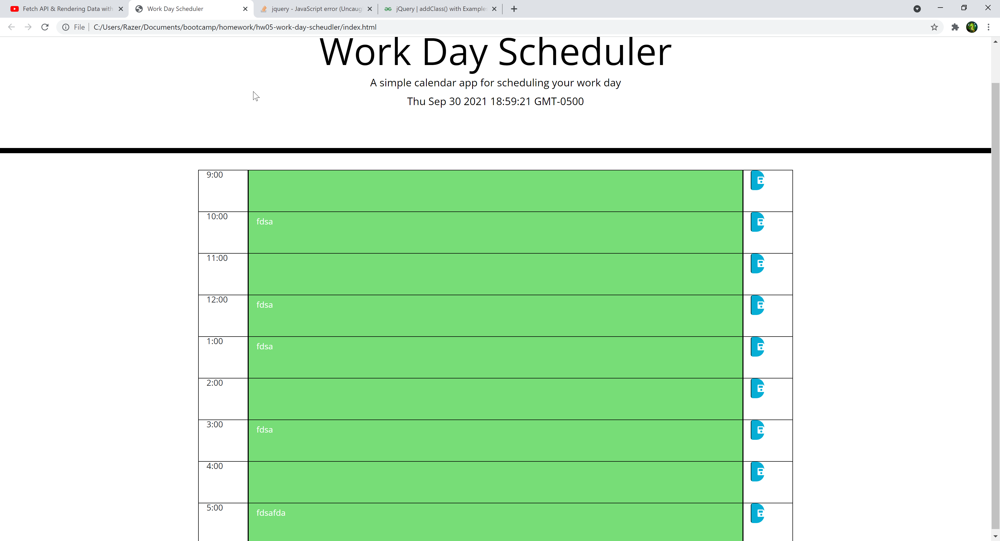

## Hw05-work-day-scheudler
# Objective
In this homework I built a schedule using local storage to save the data and keep it stored for the next time it is loaded. Using local storage everytime this webpage is loaded up it will display what someone has saved into it. I had a hard time with the momentjs I still have to fidle with it.
## Screenshot

## Deployed Page
https://tanneroliver.github.io/hw05-work-day-scheudler/
